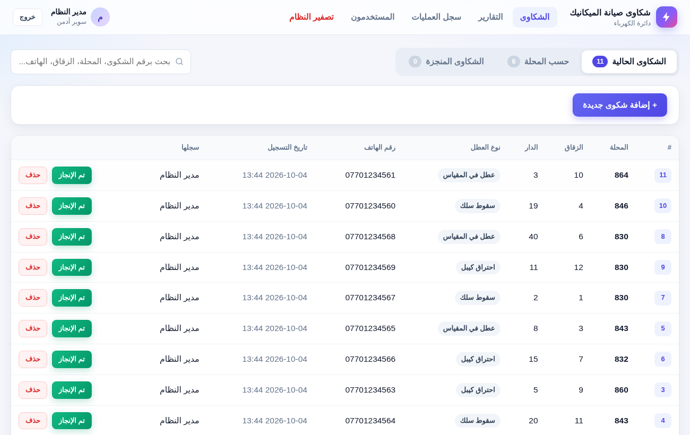
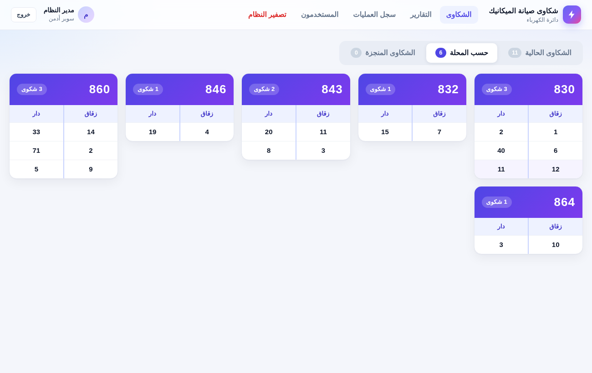
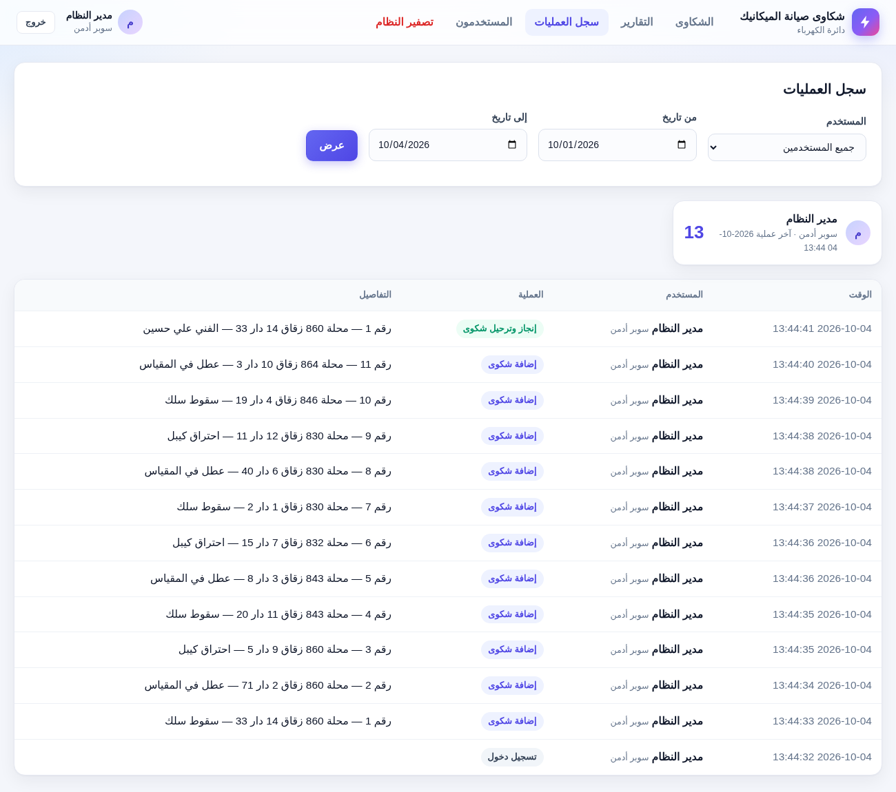
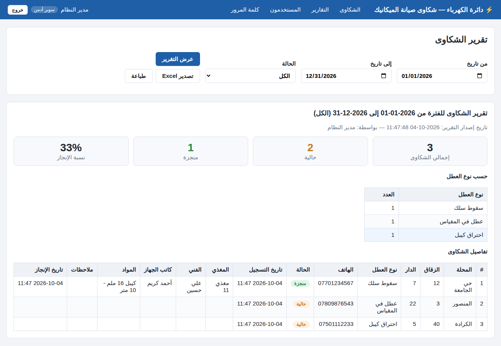

# نظام إدارة شكاوى دائرة الكهرباء — صيانة الميكانيك

نظام ويب بسيط باللغة العربية لتسجيل شكاوى المواطنين ومتابعتها حتى الإنجاز، مع صلاحيات للمستخدمين وتقارير حسب التاريخ.

## الواجهة الرئيسية

ثلاثة تبويبات: **الشكاوى الحالية**، **حسب المحلة**، و **الشكاوى المنجزة**.

- إضافة شكوى: المحلة، الزقاق، الدار، نوع العطل، رقم هاتف صاحب الشكوى.
- أمام كل شكوى حالية زر **تم الإنجاز**: يُدخل فيه (المغذي، اسم الفني، كاتب الجهاز، المواد المستخدمة إن وجدت، ملاحظات) ثم **ترحيل** فتنتقل الشكوى إلى المنجزة.
- بحث برقم الشكوى أو المحلة أو الزقاق أو الهاتف.



### تبويب «حسب المحلة»
مربع لكل محلة فيه شكاواها الحالية (زقاق / دار)، مرتبة حسب رقم المحلة. الضغط على أي سطر يفتح تفاصيل الشكوى.



## الصلاحيات

| الصلاحية | إضافة شكوى | رؤية الشكاوى | تم الإنجاز / ترحيل | التقارير | سجل العمليات | حذف شكوى | إدارة المستخدمين | تصفير النظام |
|---|:-:|:-:|:-:|:-:|:-:|:-:|:-:|:-:|
| موظف الشكاوى | ✔ | ✔ | ✔ | | | | | |
| مدير الصيانة | ✔ | ✔ | | ✔ | ✔ | | | |
| سوبر أدمن | ✔ | ✔ | ✔ | ✔ | ✔ | ✔ | ✔ | ✔ |

يمكن تعديل الصلاحيات من قاموس `PERMISSIONS` في أعلى ملف `app.py`.

السوبر أدمن يضيف المستخدمين (موظف شكاوى أو مدير صيانة)، ويستطيع تعطيلهم أو تغيير كلمات مرورهم أو حذفهم.
المستخدم المحذوف لا يستطيع الدخول، لكن يبقى اسمه ظاهراً على الشكاوى والعمليات التي قام بها سابقاً.

**تصفير النظام:** يحذف جميع الشكاوى وسجل العمليات (والمستخدمين اختيارياً)، ويتطلب كلمة مرور السوبر أدمن وكتابة كلمة «تصفير» للتأكيد.

## سجل العمليات

يسجل النظام كل عملية مع اسم المستخدم ووقتها: الدخول والخروج، إضافة/إنجاز/حذف شكوى، إدارة المستخدمين، تصدير التقارير والتصفير.
يمكن للسوبر أدمن ومدير الصيانة تصفية السجل حسب المستخدم والفترة.



## النسخ الاحتياطي

من صفحة **النسخ الاحتياطي** (للسوبر أدمن) يتم تنزيل نسخة كاملة من قاعدة البيانات كملف `.db` على الجهاز بضغطة زر.
يُنصح بتنزيل نسخة أسبوعياً وقبل أي تصفير.

## التقارير

اختيار الفترة (من تاريخ — إلى تاريخ) والحالة (الكل / الحالية / المنجزة)، ويعرض:
إجمالي الشكاوى، الحالية، المنجزة، نسبة الإنجاز، التوزيع حسب نوع العطل، وتفاصيل كل شكوى.
يمكن **طباعة** التقرير أو **تصديره إلى Excel** (ملف CSV يدعم العربية).



## التشغيل

يحتاج Python 3.9 أو أحدث.

```bash
cd complaints_system
pip install -r requirements.txt
python app.py
```

ثم افتح المتصفح على `http://localhost:5000` (أو `http://<عنوان-الجهاز>:5000` من أجهزة الشبكة الداخلية).

**الدخول الأول:** اسم المستخدم `admin` وكلمة المرور `admin123` — **غيّرها فوراً** من صفحة "كلمة المرور".

قاعدة البيانات (SQLite) تُحفظ في `instance/complaints.db`؛ انسخ هذا الملف دورياً كنسخة احتياطية.

جميع الأوقات (تاريخ التسجيل، الإنجاز، سجل العمليات، التقارير) تُسجّل بتوقيت بغداد مهما كان توقيت السيرفر.

متغيرات اختيارية: `PORT` (المنفذ)، `COMPLAINTS_DB` (مسار قاعدة البيانات)، `SECRET_KEY`.

## التحديث على PythonAnywhere

```bash
cd ~/MustafaMohammed97 && git pull
```
ثم اضغط **Reload** من صفحة Web. البيانات الموجودة تبقى كما هي، وقاعدة البيانات تُرقّى تلقائياً.

## الاختبارات

```bash
pip install pytest
python -m pytest tests
```

## حقوق البرمجة

الإصدار **1.3.0** — تمت البرمجة من قبل المبرمج **مصطفى محمد**
(mustafa97.altaee@gmail.com). سجل الإصدارات موجود في صفحة «حول النظام».
